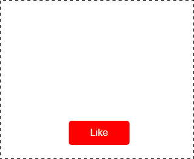

[GitHub Pages](https://lekseff.github.io/Collapsible/)

#### Легенда

Все любят кнопки лайков, вам поручили реализовать одну из них.

#### Описание

Реализуйте поведение, указанное на картинке:

Данные для анимации:
1. Изображение - 
1. Высота, на которой исчезают лайки - 200px
1. Макс. отклонение влево/вправо - 50px
1. Скорость анимации - 500ms
1. Функция анимации - ease-out (можете использовать другую)
1. Возможные траектории (траектория выбирается рандомно):
    1. 0% - центр, 25% - влево, 50% - центр, 75% - вправо, 100% - центр
    1. 0% - центр, 25% - центр, 50% - вправо, 75% - влево, 100% - центр
    1. 0% - центр, 25% - центр, 50% - влево, 75% - вправо, 100% - центр
    1. 0% - центр, 25% - вправо, 50% - центр, 75% - влево, 100% - центр

**Важно**: обратите внимание, что элементы после "исчезания" должны удаляться из DOM. Используйте для этого соответствующие события, а не таймауты.